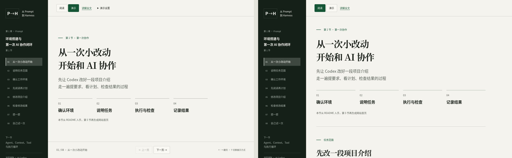

# 第一章工作草稿 · HTML 讲义

> 本目录是工作草稿，不是正式课程演示。当前视觉效果请查看 [`demos/visual-system/`](../../visual-system/)。

从修改一段项目介绍开始，练习向 Codex 发出请求，并找到、检查实际文件变化。首次演示把阅读与修改拆开，计划只需一句话；熟悉后可合并请求。当时按面向学员的页面形式进行试验，尚未确认为正式授课内容。



原尺寸画面：[演示模式](previews/slides.png) · [阅读模式](previews/scroll.png)。这些截图保留文案精简前的展示样式，当前文字以本地页面为准。

## 打开

打开 `index.html` 进入第 1 章导航首页，无需安装依赖。也可从此目录运行：

```bash
python3 -m http.server 8841 --bind 127.0.0.1
```

- [阅读模式（默认）](http://127.0.0.1:8841/)
- [第 1 节阅读模式](http://127.0.0.1:8841/ch01-01.html) · [第 1 节演示模式](http://127.0.0.1:8841/ch01-01.html?mode=slides#opening)
- [第 2 节阅读模式](http://127.0.0.1:8841/ch01-02.html) · [第 2 节演示模式](http://127.0.0.1:8841/ch01-02.html?mode=slides#opening)
- [第 3 节阅读模式](http://127.0.0.1:8841/ch01-03.html) · [第 3 节演示模式](http://127.0.0.1:8841/ch01-03.html?mode=slides#opening)
- [第 4 节阅读模式](http://127.0.0.1:8841/ch01-04.html) · [第 4 节演示模式](http://127.0.0.1:8841/ch01-04.html?mode=slides#opening)
- [第 5 节阅读模式](http://127.0.0.1:8841/ch01-05.html) · [第 5 节演示模式](http://127.0.0.1:8841/ch01-05.html?mode=slides#opening)
- [第 6 节阅读模式](http://127.0.0.1:8841/ch01-06.html) · [第 6 节演示模式](http://127.0.0.1:8841/ch01-06.html?mode=slides#opening)
- [第 1 节讲解全文](http://127.0.0.1:8841/speaker.html) · [第 2 节讲解全文](http://127.0.0.1:8841/speaker-02.html) · [第 3 节讲解全文](http://127.0.0.1:8841/speaker-03.html)

每个小节共享自己的 `lesson-*.js` 内容源和同一套阅读/演示逻辑；第 1 节共 8 个讲述点，第 2、3 节各 9 个讲述点，第 4–6 节分别按本节 lesson 内容源生成。阅读时连续滚动，演示时按屏翻页；切换模式会保留当前位置与自检答案的展开状态。

## 操作

- 顶部切换阅读/演示，左侧目录跳到讲述点。
- 演示模式：方向键左右、PageUp / PageDown、Home / End；空格下一页（焦点不在按钮、链接或设置入口时）。
- `T` 切换模式，`R` 进入或退出专注演示；输入框中不拦截快捷键。
- 演示设置中可打开人像辅助框、专注演示与全屏。人像框默认隐藏，不访问摄像头；桌面演示始终保留右上方的小窗空间，阅读模式不保留。
- 专注演示隐藏目录与工具栏，可用右下按钮或 `R` 退出；按 `T` 返回阅读也会退出专注演示。
- 请求可复制；浏览器未授权剪贴板时会提示选中文字复制。
- 自检解析默认收起。讲解全文在独立页面，包含完整解释和请求示例。

字体、样式、脚本均为本地资源；页面没有 API、第三方 CDN、分析统计、账号或后端。离线能浏览，不意味着实际 App 操作可离线完成。

## 内容与备课文档

- `lesson.js`：页面要点、请求和完整讲解，共享内容源
- `lesson-02.js`–`lesson-06.js`：第 2–6 节页面内容源；各节页面共享同一套阅读/演示逻辑
- `practice-04.html`–`practice-06.html`：第 4–6 节练习、操作、验收和判断材料
- [录制说明](../../../docs/archive/working-drafts-ch01/ch01-01-recording-notes.json)：时长、画面切点、实操与剪辑提示，不在公开页面加载
- [备课逐字稿](../../../docs/archive/working-drafts-ch01/ch01-01-script.md)：合并讲解与录制说明的 Markdown
- [第 1 章 storyboard](../../../docs/archive/working-drafts-ch01/ch01-storyboard.md)
- [课程共识：录播与独立学习约定](../../../docs/design/course-design-principles.md#录播与独立学习约定)
- [录制讨论归档](../../../discuss/2026-09-21-recording-consensus.md)
- [第一节环境卡](../../../docs/archive/working-drafts-ch01/ch01-01-environment.md)：Starter Repo 确定后填写真实地址、版本、命令和正常输出
- [课前准备与排障](preparation.html)：学员查看安装、目录检查、恢复与继续路径
- [编辑规范与改稿清单](../../../docs/production/editorial-checklist.md)：后续课程沿用的备稿要求；逐字稿由内容源导出，不单独修改
- [编辑规范与改稿清单](../../../docs/production/editorial-checklist.md)：反复出现的标点、材料分层和连贯性判断；新章节先按此记录走查

修改内容后同步生成备课逐字稿，并更新本地字体子集：

```bash
python3 scripts/export-script.py
python3 scripts/subset-fonts.py
```

字体使用本机 Noto CJK 的简体中文子集，随附 SIL OFL 授权。更新字体需 fontTools、Brotli 和系统 Noto CJK；普通浏览不需要这些工具。

## 验证边界

浏览器检查记录见 [verification.md](verification.md)。页面中的 diff 是教学示例；App 实操、Starter Repo、会议录制分辨率、音频和后期交付需要真实试录。
